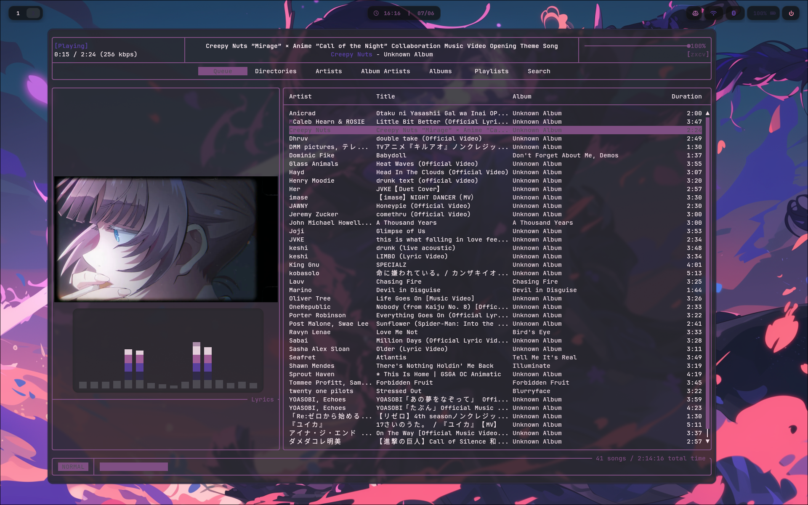
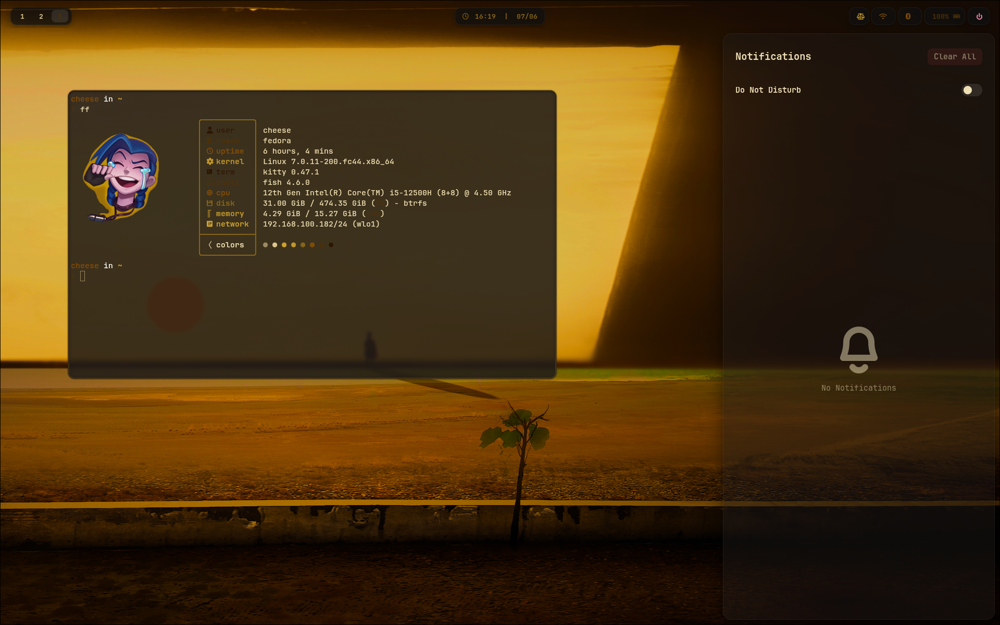
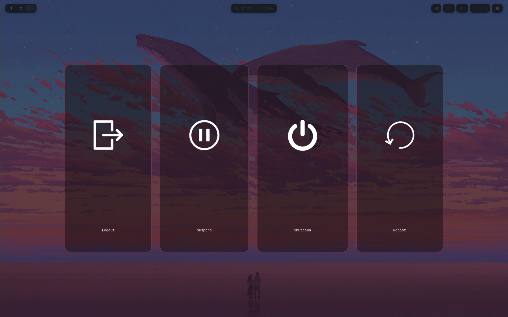
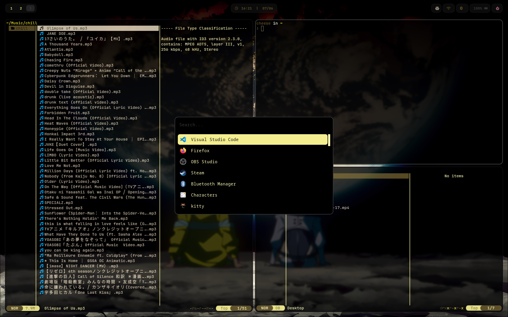

# 🌌 Cheese's Fedora Hyprland Dotfiles

  
  
  
  

---

A modern, fluid, and fully dynamic **Hyprland ecosystem** built on top of **Fedora Linux**. Powered by the latest **Hyprland Lua configuration framework**, featuring dynamic color-scheming via **Wallust**, seamless screen sharing, and a polished GNOME-like notification workflow.

---

## Video Showcase

  <video src="demo/video.mp4" width="100%" controls autoplay loop muted>
    Your browser does not support the video tag.
  </video>
  
<i>A quick tour of system animations, workspace switching, and dynamic theme reloading.</i>

 

## Screenshots

 Expand to view Workspace Screenshots

 

  
  
   
  

   
  

   
  

---

## Key Features

- **Pure Lua Orchestration:** Completely migrated to the cutting-edge **Hyprland 0.55+ Lua configuration**, bidding farewell to traditional `.conf` syntax for advanced modular logic.
- **Dynamic Wallust Theming:** Palette configurations change instantly based on your wallpaper. Colors propagate fluidly to Waybar, SwayNC, and terminal profiles.
- **GNOME-like Status Popups:** WiFi (`nmtui`) and Bluetooth (`blueman-manager`) act as discrete, floating corner popups aligned directly under Waybar, bypassing intrusive fullscreen tiles.
- **Complete SwayNC Workflow:** Customized Control Center with responsive volume/brightness sliders, media player metadata integrations (MPRIS), and hard-hidden persistent scrollbars.
- **Streamlined MPD + rmpc Setup:** Custom Fish shell automation scripts (`ytmp3`) to fetch, embed rich metadata/thumbnails, index to Music database, and pipe instantly into the `rmpc` client queue.
- **Fixed PipeWire Screencast:** Implemented strict asynchronous environment boot-sequencing for `xdg-desktop-portal-hyprland`, fixing cross-application screen sharing once and for all.

---

## System Components & Architecture

| Component | Software Chosen | Purpose |
| :--- | :--- | :--- |
| **OS** | Fedora Linux | Core cutting-edge stable base |
| **Window Manager** | Hyprland (0.55+) | Fluid Wayland Compositor |
| **Status Bar** | Waybar | Highly customized styling & system monitors |
| **Notification Center** | SwayNC | Rich notification agent & control center |
| **Wallpaper Daemon** | swww | Animated background transition layer |
| **Shell Environment** | Fish Shell | Interactive, user-friendly shell engine |
| **Audio Server** | PipeWire + WirePlumber | Resilient audio layout backend |
| **Music Controller** | MPD + rmpc | Lightweight backend daemon with a Vim-like TUI client |

---